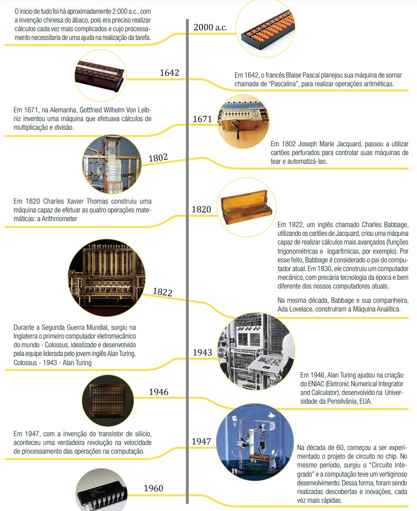

# Fundamentos de Informática

## 1.1 Conceitos Importantes
Tecnologia é o uso do conhecimento para criar soluções úteis — não está limitada a coisas modernas.

O computador é uma ferramenta tecnológica programável.

Computação é a área do conhecimento que se dedica ao estudo sistemático dos computadores, abrangendo tanto seus aspectos físicos (hardware) quanto lógicos (software).

Informática é a ciência que estuda o tratamento da informação por meio da utilização de computadores e outros dispositivos digitais. Seu foco está na coleta, armazenamento, processamento, transmissão e recuperação de dados, transformando-os em informações úteis para os mais diversos contextos, como a comunicação, a tomada de decisões e a automação de processos.

Informação é o resultado do processamento de dados brutos — dados organizados e com significado.

## 1.2 História e Evolução do Computador
A informática evoluiu muito e está presente em diversas áreas do dia a dia.

O desenvolvimento do computador passou por várias fases até chegar aos dispositivos modernos.

### Linha do Tempo: desenvolvimento do computador

  

## 1.3 Classificação dos Computadores
Existem diferentes tipos de computadores, com usos e tamanhos variados:

**Mainframe**: supercomputadores usados em empresas e pesquisas.

**Microcontrolador**: pequenos computadores embutidos em eletrodomésticos e carros.

**Smartphone**: celular com múltiplas funções tecnológicas.

**Tablet**: dispositivo portátil com tela sensível ao toque.

**Notebook/Ultrabook/Netbook**: computadores portáteis com diferentes níveis de desempenho.

**Desktop**: computador de mesa tradicional, com gabinete e periféricos separados.

## 1.4 Princípios de Funcionamento
- Todos os computadores seguem o princípio de: **entrada → processamento → saída**.

- Um bit é a unidade mínima de informação em computação, representando um valor de 0 ou 1. Um byte é um grupo de 8 bits. 

- Um Byte é um conjunto de 8 bits, usado para representar letras, números e símbolos (ex.: “A” = 65 na tabela ASCII).

- Dados são elementos brutos; informação é o resultado do processamento e organização dos dados.

- Unidades de medida como KB (quilobyte), MB (megabyte), GB (gigabyte) e TB (terabyte) representam múltiplos do byte, sendo baseadas em potências de 2. Cada unidade corresponde a uma quantidade maior de bytes: por exemplo, 1 KB equivale a 1.024 bytes, 1 MB a 1.024 KB, 1 GB a 1.024 MB e 1 TB a 1.024 GB. Essas unidades são usadas para medir a capacidade de armazenamento e o tamanho de arquivos nos sistemas digitais.

## Internet
A Internet transformou profundamente a forma como vivemos, trabalhamos, nos comunicamos e acessamos informações. Sua origem está ligada à Guerra Fria, quando os Estados Unidos buscavam formas seguras de comunicação em caso de ataques. Esse contexto levou à criação da DARPA, que iniciou pesquisas para desenvolver redes de computadores descentralizadas.

Em 1961, surgiu a teoria da comutação de pacotes, permitindo a transmissão eficiente de dados. Logo depois, em 1965, ocorreu a primeira WAN (rede de longa distância) e, em 1969, nasceu a ARPANET, a primeira rede que conectou universidades por meio de nós. Em 1972, surgiu o e-mail, revolucionando a comunicação. Já em 1983, a adoção do protocolo TCP/IP tornou possível a comunicação entre diferentes redes, consolidando a estrutura da Internet moderna.

Em 1989, Tim Berners-Lee criou a World Wide Web (WWW), permitindo o acesso e compartilhamento de documentos em hipertexto por navegadores. Com a popularização da Web e do protocolo TCP/IP, a Internet deixou de ser exclusiva de militares e cientistas e passou a alcançar empresas e o público em geral.

Nos anos 1990, a Internet começou a ser utilizada comercialmente, impulsionando o comércio eletrônico, a educação a distância, e promovendo a transformação digital em vários setores. O lançamento do Google, em 1997, facilitou o acesso a informações, e o surgimento de redes sociais e plataformas como o YouTube consolidou a Internet como meio de comunicação, informação e entretenimento.

Atualmente, a internet é caracterizada pela interação entre os usuários, pela criação colaborativa de conteúdo e pelo desenvolvimento de tecnologias centradas nas pessoas. Ela se consolidou como um dos pilares do mundo moderno, impactando profundamente todos os aspectos da sociedade.

## A História da Internet no Brasil
[Assista ao vídeo](https://www.youtube.com/watch?v=k_inQhpKprg)

