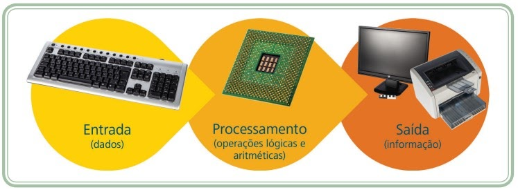

# Noções de Hardware

## **Conceitos importantes**
O termo hardware refere-se à parte física de um computador e seus componentes. Embora seja muito usado na informática, também pode se aplicar a outros equipamentos eletrônicos. A estrutura básica do funcionamento do computador envolve: entrada → processamento → saída.

  

O hardware é dividido em:

- CPU (Central Processing Unit): unidade central de processamento,

- Memória,

- Periféricos.

## **Processador (CPU)**
A CPU é o "cérebro" do computador, responsável pelos cálculos e controle. Sua velocidade depende do clock, medido em Hz (hertz) e seus múltiplos:

- MHz (megahertz): milhões de ciclos por segundo,

- GHz (gigahertz): bilhões de ciclos por segundo.

A CPU é formada por:

- ULA (Unidade Lógica e Aritmética): realiza cálculos matemáticos e lógicos,

- UC (Unidade de Controle): coordena a execução das instruções.

A CPU é conectada à placa-mãe, que interliga todos os componentes do computador.

## **Memória**
A memória armazena dados temporários ou permanentes usados pelo computador. É classificada em:

**Memória principal**
- RAM (Random Access Memory): volátil; perde os dados ao desligar. É medida em:

    - KB (Kilobyte): 1.024 bytes,

    - MB (Megabyte): 1.024 KB,

    - GB (Gigabyte): 1.024 MB.

- ROM (Read Only Memory): não volátil, contém instruções fixas do sistema.

- Cache: muito rápida e pequena; armazena dados mais usados pela CPU.

**Memória secundária**
- Armazena dados de forma permanente, mesmo sem energia.

- Exemplos:

    - HD (Hard Disk): disco rígido magnético.

    - SSD (Solid State Drive): mais rápido e moderno que o HD.

    - Disquetes, CDs, DVDs: usados no passado.

    - Fitas magnéticas: ainda usadas para backups em empresas.

    - Memórias flash (pendrives, cartões de memória): portáteis e confiáveis.

Esses dispositivos também têm sua capacidade medida em:

- GB (Gigabyte),

- TB (Terabyte): 1.024 GB.

## **Periféricos de entrada**
São dispositivos usados para enviar informações ao computador.

**Teclado:** Permite digitação e controle. Existem vários tipos (tradicional, numérico, USB, sem fio).

**Mouse:** Dispositivo apontador que movimenta o cursor. Pode ser com ou sem fio. Touchpads substituem o mouse em notebooks.

Outros dispositivos de entrada
- **Microfone**

- **Leitor de código de barras**

- **Joystick**

- **Mesa digitalizadora**

- **Webcam**

- **Scanner** 

## **Periféricos de saída:**
Apresentam os resultados do processamento.

**Monitor:**
Exibe as informações na tela. Tipos:

- CRT (antigo),

- LCD (cristal líquido),

- LED (mais moderno),

- Projetores multimídia (Datashow).

**Impressora:**
Imprime dados em papel. Tipos:

 - Matricial: usa agulhas, ideal para folhas carbonadas,

 - Jato de tinta: usa cartuchos de tinta,

 - Laser: usa toner, mais rápida e econômica.

**Áudio:**
Caixas de som e fones de ouvido transmitem sons e músicas.

**Periféricos de entrada e saída (I/O):**
Dispositivos como HDs, pendrives, leitores de cartões, etc., podem enviar e receber dados, funcionando como entrada e saída ao mesmo tempo.
