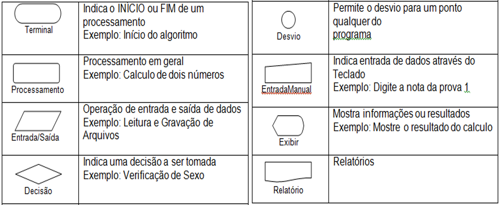
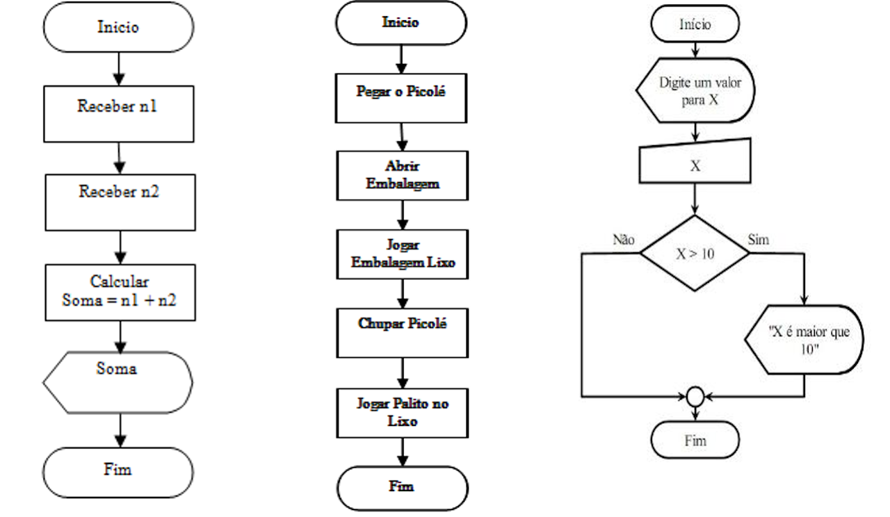

# Fluxogramas e Programação em Blocos

## **1. Programação em Blocos**
A **programação em blocos** é uma metodologia visual utilizada principalmente no ensino de lógica de programação. Ela substitui a escrita tradicional de código por **blocos gráficos coloridos**, que representam **instruções**, **ações** ou **comandos**. Esses blocos se encaixam como peças de um quebra-cabeça, facilitando a criação de algoritmos de forma intuitiva.

### Vantagens:
- Ideal para iniciantes, pois elimina a necessidade de conhecer a linguagem de programação.

- Facilita o entendimento da sequência lógica de um algoritmo.

- Ajuda no desenvolvimento do raciocínio lógico.

- Permite compreender conceitos fundamentais como condições (se/senão), laços de repetição, funções, variáveis, entre outros.

### Ferramentas populares:
- Code.org – plataforma educacional com lições e desafios interativos.

- Scratch – permite criar histórias, jogos e animações com blocos.

- Blockly – ensina lógica de programação por meio de jogos com desafios progressivos.

### Por que aprender com Programação em Blocos?
A programação em blocos desenvolve o pensamento computacional, ou seja, a capacidade de:

- Analisar problemas

- Criar soluções passo a passo

- Pensar logicamente e de forma estruturada

- Aprende a resolver problemas com algoritmos

## **2. Fluxogramas**
O fluxograma é uma representação visual e padronizada de um algoritmo, mostrando o fluxo de ações por meio de símbolos geométricos conectados por setas.

### Características:
- Tem início, meio e fim bem definidos.

- Cada símbolo representa uma etapa da execução.

- Facilita o entendimento, comunicação e documentação de algoritmos.

### Aplicações:
- Ideal para visualizar problemas complexos.

- Ajuda na compreensão e planejamento de processos antes de implementar o código.

- Ainda é usado para modelar regras de negócio e fluxos de trabalho.

  

  

## 3. **Conclusão**
Tanto os fluxogramas quanto a programação em blocos são métodos para entender, planejar e executar algoritmos.
