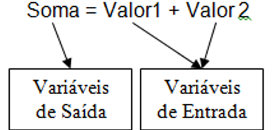
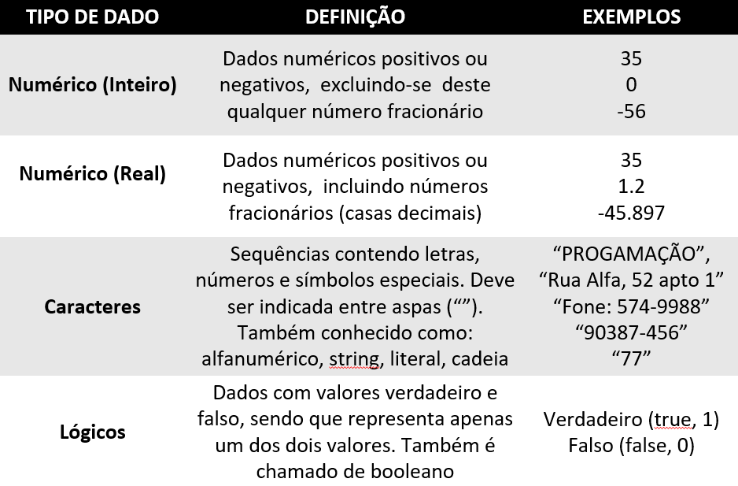

# Variáveis, Constantes e Tipos Dados

## 1. O que são Variáveis e Constantes?
- **Variáveis**: são espaços na memória RAM utilizados para armazenar valores que podem ser alterados durante a execução de um programa.

    - Exemplos:

        `idade = 30`

        `salario = 2500.00`

- **Constantes**: Também são espaços na memória, mas guardam valores fixos que não mudam enquanto o programa roda.

    - Exemplos: 

        `PI = 3.1416` 
            
        `const real TAXA_FGTS = 0.08`

<br>
<div>
  
</div>
<br>

Temos 3 variáveis: SOMA, VALOR1 E VALOR2. 

- **Variáveis de Entrada** armazenam informações fornecidas por um meio externo, normalmente usuários ou discos. 

- **Variáveis de Saída** armazenam dados processados como resultados.


## 2. Como funcionam?
Ao criar um programa, você precisa reservar espaço na memória para guardar dados. Isso é feito declarando variáveis ou constantes.

Cada espaço tem:

- Um nome (identificador)

- Um tipo (inteiro, real, texto, etc.)

- Um valor

## 3. Memória RAM e armazenamento

- A memória RAM (*Memória de Acesso Aleatório*) armazena temporariamente os dados e instruções usados pelos programas em execução.

- Durante a execução de um programa, cada variável ou constante ocupa um endereço específico na RAM.

- Como a RAM é uma memória volátil, todo o conteúdo nela armazenado é perdido quando o computador é desligado.

## 4. Tipos de Dados
Variáveis e constantes devem ser declaradas com tipos de dados, que indicam ao computador quanto espaço na memória reservar e como interpretar os valores armazenados.

Os tipos de dados determinam, por exemplo, se o valor será tratado como um número inteiro, um número com casas decimais, um caractere ou um texto.

Principais tipos:

- **Inteiro (int)**: representa números sem casas decimais. Exemplo → `idade = 25`

- **Real (float/double)**: representa números com casas decimais. Exemplo → `salario = 2500.75`

- **Caractere (char)**: representa um único caractere, como uma letra ou símbolo. Exemplo → `letra = 'A'`

- **Lógico (bool)**: representa valores booleanos, ou seja, verdadeiro ou falso. Exemplo → `aprovado = true`

<div>
  
</div>


## 5. Sintaxe de Declaração
Variável:
```cs
tipo nome_da_variavel
```
Exemplo: `real salario`

Constante:

```cs
const tipo NOME_DA_CONSTANTE = valor
```
Exemplo: `const real PI = 3.1416`

## 6. Regras para nomes (identificadores)
- Devem ser claros e descritivos (ex: altura, não x)

- Começar com letra ou underline (_)

- Não usar espaços, acentos ou caracteres especiais

- Máximo de 127 caracteres

- Minúsculas para variáveis, maiúsculas para constantes

- Não usar palavras reservadas da linguagem (ex: if, for, while)

## 7. Dicas Importantes
Variáveis são mais usadas do que constantes, pois permitem alterações nos dados.

Toda variável ou constante possui:

- Um tipo (como inteiro, real, caractere, etc.)

- Um nome que a identifica

- Um valor armazenado (fixo, no caso das constantes, e mutável nas variáveis)

Esses elementos são fundamentais para representar dados em algoritmos, seja na entrada, no processamento ou na saída das informações.