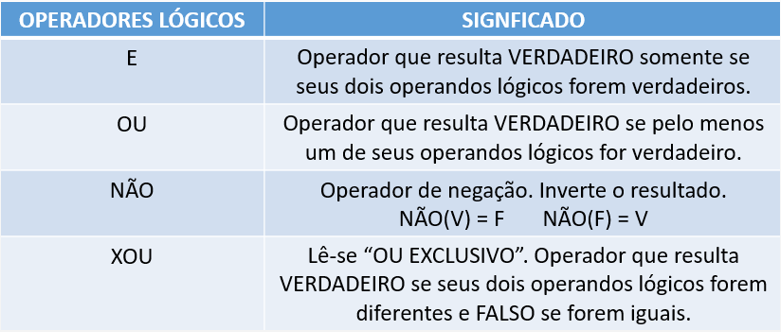

# Estruturas de Decisão - Condicionais

## 1. Operadores Lógicos e Relacionais

- **Operadores Relacionais**: Comparam dois valores e retornam verdadeiro (true) ou falso (false). Exemplos:

`==` (igual)

`>` (maior)

`<` (menor)

`>=` (maior ou igual)

`<=` (menor ou igual)

`!=` (diferente)

<div>
  
</div>
<br>

Considere duas variáveis inteiras, **A** e **B** onde `A = 5` e `B = 8` e analise o quadro abaixo.

<div>
  
</div>
<br><br>

- **Operadores Lógicos**: Usados para combinar condições lógicas. Também retornam verdadeiro ou falso:

    - `E (&&)` → verdadeiro se todas as condições forem verdadeiras.

    - `OU (||)` → verdadeiro se pelo menos uma condição for verdadeira.

    - `NÃO (!)` → inverte o valor lógico (de verdadeiro para falso, e vice-versa).

<div>
  
</div>
<br>

Variáveis `A = 5` e `B = 8`

<div>
  
</div>
<br> <br>

- **Tabela Verdade**: Mostra o resultado final de expressões compostas com E, OU e NÃO.
<div>
  
</div>
<br>


# 2. Estruturas de Decisão (Condicionais)

Permitem que o programa tome decisões com base em condições.

### SE (if)

- Executa um bloco de código somente se a condição for verdadeira.

```js
se (condição) {
  // comandos executados se condição for verdadeira
}
```

**Exemplo 1:**
> ``` js
> Se a frequência do aluno ≥ 75%, 
> exibir "Aprovado".
> ```

**Exemplo 2:**

Em Uma empresa será solicitado o salário de um determinado funcionário para se calcular seu novo salário, sendo que, se este tiver um salário inferior a R$ 1000,00, o reajuste será de 8%. Observe que teremos que testar o valor do salário, para saber se o reajuste será aplicado ou não.

<div>
  
</div>
<br>

### SE - SENÃO (if - else)

- Executa um bloco se a condição for verdadeira, senão executa outro bloco.

```js
se (condição) {
  // comandos executados se condição for verdadeiro;
} senão {
  // comandos executados se condição for falsa;
}
```

**Exemplo 1:**
> ``` js
> Se hora ≥ 6 e ≤ 18 → "É dia"; 
> senão → "É noite".
> ```

**Exemplo 2:**

Em uma empresa será solicitado o salário de um determinado funcionário para se calcular seu novo salário, sendo que, se este tiver um salário inferior a R$ 1000,00, o reajuste será de 8%, caso contrário o reajuste será de 5%.

<div>
  
</div>
<br>

### SE - SENÃO - SE (if - else if - else)

- Permite testar várias condições sequencialmente.

```js
se (condição1) {
   // comandos
} senao se (condição2) {
   // outros comandos
} senao {
   // comandos finais se todas as anteriores forem falsas
}
```
**Exemplo 1:**
> ``` js
> Se nota ≥ 9 → "Muito bem",
> senão se nota ≥ 7 → "Bem",
> senão → "Reprovado".
> ```


**Exemplo 2:**

Em uma empresa será solicitado o salário de um determinado funcionário para se calcular seu novo salário, sendo que, se este tiver um salário inferior a R$ 1000,00, o reajuste será de 8%, caso o salário for maior que R$ 2000,00, o reajuste será de 2%, caso contrário o reajuste será de 5%.

<div>
  
</div>
<br>

### ESCOLHA - CASO (switch - case)
- Usado para verificar valores fixos de uma variável.
- Não usa operadores lógicos, apenas igualdade.

```js
escolha (variável) {
  caso valor1:
    // comandos;
    pare;
  caso valor2:
    // comandos;
    pare;
  caso contrario:
    // comandos;
}
```

> **Exemplo:**
> ``` js
> Se opção = 1 → "Soma",
> se = 2 → "Subtração",
> caso contrário → "Opção inválida".
> ```

## Conclusão
- Operadores lógicos e relacionais são usados para montar condições lógicas.

- Estruturas condicionais (SE, SE-SENÃO, SE-SENÃO-SE, ESCOLHA-CASO) controlam o fluxo do algoritmo com base nessas condições.
