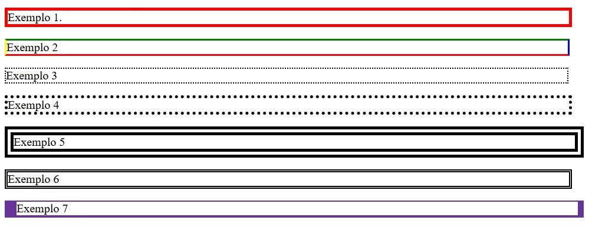

# Imagens, Mídias, Estilização e Tabelas

## **1. Imagens**

### Tags importantes:

- ``: Exibe uma imagem.

    - `src`: Caminho da imagem (interno ou externo).

    - `alt`: Texto alternativo (importante para acessibilidade).

- `<figure>`: Agrupa a imagem e a legenda.

- `<figcaption>`: Legenda da imagem.

Exemplo:
```html
<figure>
    
    <figcaption>Legenda</figcaption>
</figure>
```

## **2. Imagens como Links**

Envolver a tag `` com `<a>` transforma a imagem em link.

### Tags:
- `<a>`: Cria um link.

- `href`: URL de destino.

- `target="_blank"`: Abre o link em nova aba.

Exemplo:
```html
<a href="https://www.url-do-site.com.br" target="_blank">
  
</a>
```
## **3. Favicon**

### Tag:

- `<link rel="icon" href="caminho/favicon.png" />`: Define o ícone da aba do navegador.

Exemplo:
```html
<head>
  <link rel="icon" href="favicon.png" />
</head>
```

## **4. Áudio e Vídeo**

### Tags:

- `<audio>` e `<video>`: Reproduzem mídias.

- `<source>`: Define o arquivo de mídia.

- Atributos comuns: `controls`, `autoplay`, `loop`, `muted`.

Exemplo de vídeo:
```html
<video width="400px" controls>
  <source src="video.mp4" type="video/mp4" />
</video>
```

Exemplo de áudio:
```html
<audio controls>
  <source src="musica.mp3" type="audio/mpeg" />
</audio>
```

## 5. Tabelas em HTML
### Tags:

- `<table>`: Cria a tabela.

- `<tr>`: Linha da tabela.

- `<td>`: Célula (dado).

- `<th>`: Cabeçalho (texto em negrito e centralizado).

- `<caption>`: Título da tabela.

- `<thead>`, `<tbody>`, `<tfoot>`: Estrutura semântica.

- `colspan` e `rowspan`: Mesclam colunas ou linhas.

Exemplo:
```html
<table border="1">
  <caption>Lista de Cursos</caption>
  <thead>
    <tr>
      <th>Curso</th>
      <th>Preço</th>
    </tr>
  </thead>
  <tbody>
    <tr>
      <td>HTML</td>
      <td>R$10,00</td>
    </tr>
    <tr>
      <td rowspan="2">CSS</td>
      <td>R$15,00</td>
    </tr>
    <tr>
      <td>R$12,00</td>
    </tr>
  </tbody>
  <tfoot>
    <tr>
      <td colspan="2">Total: R$37,00</td>
    </tr>
  </tfoot>
</table>
```

## **6. Aplicando CSS (Folhas de Estilo)**
Formas de aplicar:

### a) Inline (dentro da tag):
```html
<h1 style="color: red;">Texto vermelho</h1>
```

### b) Interno (dentro da tag `<head>`):
```html
<head>
  <style>
    h1 {
      color: blue;
    }
  </style>
</head>
```

### c) Externo (arquivo separado):
```html
<head>
  <link rel="stylesheet" href="estilo.css" />
</head>
```

## **7. Seletores CSS**

Os seletores servem para aplicar estilos (CSS) a elementos HTML específicos.

### Classe (`class`):
- Usamos o ponto (`.`) antes do nome da classe no CSS.

- Pode ser usada em vários elementos.

- Ideal para estilos repetidos em diversos lugares da página.

Exemplo
```css
/* Arquivo CSS */
.titulo {
  color: green;
}
```
```html
<!-- Arquivo HTML -->
<h1 class="titulo">Título</h1>
<p class="titulo">Parágrafo com mesmo estilo</p>
```
### ID (`id`)
- Usamos a cerquilha ou hashtag (`#`) antes do nome no CSS.

- Deve ser único e pertencer somente a um elemento da página.

- Ideal para identificar elementos específicos com estilo exclusivo.

Exemplo:
```css
/* Arquivo CSS */
#paragrafoPrincipal {
  font-size: 18px;
  text-align: justify;
}
```
```html
<!-- Arquivo HTML -->
<p id="paragrafoPrincipal">Este é um parágrafo com estilo exclusivo.</p>
```

## **8. Estilização de Texto com CSS**

Propriedades principais:

- `color`: Cor do texto.

- `font-size`: Tamanho da fonte.

- `text-align`: Alinhamento (left, center, right, justify).

- `text-decoration`: underline, none, overline, etc.

- `line-height`: Espaço entre linhas.

- `text-transform`: uppercase, lowercase, capitalize.

- `text-indent`: Recuo da primeira linha.

- `word-spacing`: Espaço entre palavras.

- `text-shadow`: Sombra no texto.


## 9. **Fontes do Google (Google Fonts)**

**Google Fonts** é um serviço gratuito da Google que oferece várias fontes personalizadas para uso em sites.

### Como usar?

#### Método 1: Importar no HTML (no `<head>`)
```html
<head>
  <link href="https://fonts.googleapis.com/css2?family=Roboto&display=swap" rel="stylesheet">
  <style>
    body {
      font-family: 'Roboto', sans-serif;
    }
  </style>
</head>
```

#### Método 2: Importar direto no arquivo CSS (`estilo.css`)
```css
@import url('https://fonts.googleapis.com/css2?family=Roboto&display=swap');

body {
  font-family: 'Roboto', sans-serif;
}
```

## **10. Plano de Fundo (Background)**

Propriedades CSS:

- `background-color`: Cor de fundo.

- `background-image`: Imagem de fundo.

- `background-repeat`: Repetição da imagem.

- `background-size`: Tamanho da imagem.

- `background-position`: Posição da imagem.

- `background-attachment`: Define se o fundo rola com o conteúdo (`scroll`) ou fica fixo na tela (`fixed`).

Exemplo:
```css
body {
  background-image: url('imagem.jpg');
  background-size: cover;
  background-repeat: no-repeat;
  background-attachment: fixed;
}
```

## **11. Bordas (Border)**
Propriedades CSS:

- `border-style`: solid, dotted, dashed, etc.

- `border-width`: Largura da borda.

- `border-color`: Cor da borda.

- `border-radius`: Bordas arredondadas.

Exemplo:
```css
/* Arquivo CSS */
.caixa {
  border: 2px solid black;
  border-radius: 8px;
  width: 200px;
  padding: 5px;
}
```

```html
<!-- Arquivo HTML -->
<div class="caixa">Conteúdo com borda</div>
```
<div>
  
</div>

<br>

### Mais Exemplos:
```css
/* Arquivo CSS */
p {
  font-size: 20px;
  width: 50%;
} 

p.um {
 border-style: solid;
 border-width: 5px;
 border-color: red;
}

p.dois {
 border-style: solid;
 border-width: medium;
 border-color: green blue red yellow;
}

p.tres {
 border-style: dotted;
 border-width: 2px;
}

p.quatro {
 border-style: dotted;
 border-width: thick;
}

p.cinco {
 border-style: double;
 border-width: 15px;
}

p.seis {
 border-style: double;
 border-width: thick;
}

p.sete {
 border-style: solid;
 border-width: 2px 10px 4px 20px;
 border-color: rebeccapurple;
}
```

```html
<!-- HTML -->
<h2>Propriedades border-width e Cores</h2>
<p class="um">Exemplo 1.</p>
<p class="dois">Exemplo 2</p>
<p class="tres">Exemplo 3</p>
<p class="quatro">Exemplo 4</p>
<p class="cinco">Exemplo 5</p>
<p class="seis">Exemplo 6</p>
<p class="sete">Exemplo 7</p>
```
<div>
  
</div>

