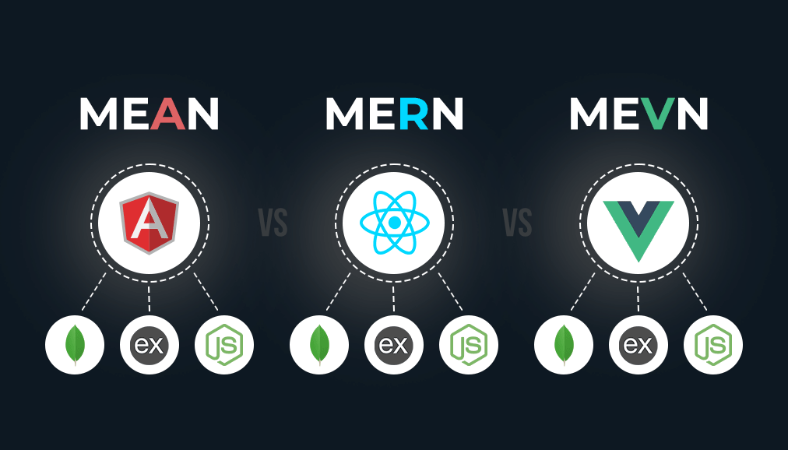

# JavaScript 

**JavaScript** é uma linguagem de programação interpretada, dinâmica e de tipagem fraca, bastante utilizada no desenvolvimento web. Ela permite criar interações e comportamentos dinâmicos em páginas HTML, sendo executada diretamente no navegador do usuário (lado cliente). Com o **Node.js**, o JavaScript também pode ser usado no lado servidor, ampliando suas possibilidades no desenvolvimento de aplicações completas (full stack).

Pode ser usada no:

- Frontend 

- Backend 

- Aplicações mobile 

- Aplicações desktop 

- Desenvolvimento de jogos

🛠️ Stacks populares

**Stacks** são combinações de tecnologias que trabalham juntas no desenvolvimento de aplicações. As mais comuns com JavaScript são:

**MEAN:** MongoDB, Express, Angular, Node.js

**MERN:** MongoDB, Express, React, Node.js

**MEVN:** MongoDB, Express, Vue, Node.js



## JavaScript e HTML

JavaScript adiciona comportamento à página, trabalhando em conjunto com:

- HTML → estrutura da página

- CSS → aparência da página

- JavaScript → interatividade e lógica

### Primeiro código JavaScript
```html
<!DOCTYPE html>
<html lang="pt-br">
  <head><meta charset="utf-8"><title>JS</title></head>
  <body>
    <h2>Começando com JavaScript</h2>
    <script>alert("Olá Técnico em Informática!");</script>
  </body>
</html>
```

### Tag `<script>`

O código **JavaScript** deve ser inserido entre as tags `<script>` (abertura) e `</script> `(fechamento). Esse script pode ser colocado tanto na seção `<head>`, quanto no `<body>` da página HTML — ou em ambos.

#### Boa prática:
Recomenda-se inserir a tag `<script>` ao final do `<body>`, para garantir que todo o conteúdo HTML da página seja carregado antes da execução do JavaScript. Isso evita erros e melhora o desempenho do carregamento.

Também é possível separar o código JavaScript em um arquivo externo, com extensão `.js`.
Nesse caso, utilizamos a tag `<script>` com o atributo `src` (source), apontando para o caminho do arquivo. Esse é o método mais utilizado:

Exemplo:
```js
// script adicionado no HTML antes da tag </body>
<script src="meuScript.js"></script>
```

**Vantagens de usar scripts externos:**

- Organização e limpeza do código HTML 

- Separação entre estrutura (HTML) e lógica (JS)

- Reutilização do script em várias páginas

- Facilidade de manutenção


### JavaScript no `<head>`

```html
<!DOCTYPE html>
<html>
    <head>
        <script>
            function minhaFuncao() {
                document.getElementById("alvo").innerHTML = "Parágrafo modificado.";
            }
        </script>
    </head>
    <body>
        <h2>Demonstração de JavaScript na seção Head</h2>
        <p id="alvo">Apenas um parágrafo</p>
        <button type="button" onclick="minhaFuncao()">Clique</button>
    </body>
</html>
```

### JavaScript no `<body>`

```html

<!DOCTYPE html>
<html>
    <head>
    </head>
        <body>
            <h2>Demonstração de JavaScript na seção Body</h2>
            <p id="alvo">Apenas um parágrafo</p>
            <button type="button" onclick="minhaFuncao()">Clique</button>
            <script>
                function minhaFuncao() {
                    document.getElementById("alvo").innerHTML = "Parágrafo modificado.";
                }
            </script>
        </body>
</html>
```

### JavaScript Externo

**Arquivo:** `meuScript.js`
```JS
function minhaFuncao() {
  document.getElementById("alvo").innerHTML = "Parágrafo modificado.";
}
```

**HTML**
```html
<!DOCTYPE html>
<html>
    <head></head>
        <body>
            <h2>Demonstração de JavaScript na seção Body</h2>
            <p id="alvo">Apenas um parágrafo</p>
            <button type="button" onclick="minhaFuncao()">Clique</button>

            <script src="meuScript.js"></script>
        </body>
</html>
```

## Variáveis e Constantes

Formas de declarar:

`var` – tem escopo global (se declarada fora de uma função) ou de função (se declarada dentro de uma função). Não respeita escopo de bloco (como dentro de `if`, `for`, etc.).

`let` – tem escopo de bloco, ou seja, é visível apenas dentro do bloco onde foi declarada (ex: `{ ... }`).

`const` – também tem escopo de bloco, mas seu valor não pode ser reatribuído. Importante: o conteúdo de objetos ou arrays declarados com `const` pode ser modificado, só a referência que é constante.


→ `var`

- Pode ser redeclarada e atualizada

- Pode causar problemas com sobrescritas inesperadas

```js
var saudacao = 'Olá'; // Variável global

function novaFuncao() {
  var oi = ' Seja Bem-vindo'; // Variável local, só existe dentro da função
  console.log(oi); // Funciona: está acessando a variável dentro do escopo dela
}

novaFuncao(); // Seja Bem-vindo
console.log(oi); // Erro: Variável "oi" não está definida fora da função
```


→ `let`

- Escopo de bloco

- **Não** pode ser redeclarada no mesmo bloco

```js

// Exemplo 01:
let saudacao = "Olá";
saudacao = "Olá de novo"; 
let saudacao = "Olá mais uma vez"; // Erro, não pode ser redeclarada


// Exemplo 02:
let mensagem = "Fora do bloco";

if (true) {
  let mensagem = "Dentro do bloco";
  console.log(mensagem); // Saída: "Dentro do bloco"
}

console.log(mensagem); // Saída: "Fora do bloco"
```

**Explicação:**

- A variável `mensagem` foi declarada duas vezes com `let`, mas em escopos diferentes.

- Dentro do `if`, ela é uma nova variável, que só existe dentro daquele bloco `{}`.

- Fora do `if`, a variável original continua inalterada.

→ `const`

- Constante (não pode ser reatribuída)

- objetos e arrays declarados com `const` podem ter seu conteúdo modificado. O que é constante é a referência, não o valor interno

```js
// Exemplo 01:
const saudacao = "Olá";
saudacao = "Erro!"; // Erro


// Exemplo 02:
const usuario = { nome: "Maria" };
usuario.nome = "João"; // OK
```

## Tipos Primitivos:

- `String`: texto

- `Number`: número

- `Boolean`: true ou false

- `Null`: valor vazio

- `Undefined`: variável sem valor definido

- `Symbol`: identificador único

##  Operadores Aritméticos

| Operador | Descrição         | Exemplo | Resultado |
|----------|-------------------|---------|-----------|
| `+`      | Adição            | 2 + 2   | 4         |
| `-`      | Subtração         | 5 - 3   | 2         |
| `*`      | Multiplicação     | 3 * 3   | 9         |
| `/`      | Divisão           | 10 / 2  | 5         |
| `%`      | Módulo (resto)    | 10 % 3  | 1         |


## Operadores Relacionais

| Operador | Descrição                   | Exemplo           | Resultado   |
|----------|-----------------------------|-------------------|-------------|
| `>`      | Maior que                   | 5 > 3             | `true`      |
| `<`      | Menor que                   | 2 < 1             | `false`     |
| `>=`     | Maior ou igual a            | 5 >= 5            | `true`      |
| `<=`     | Menor ou igual a            | 4 <= 3            | `false`     |
| `==`     | Igual (valor)               | "5" == 5          | `true`      |
| `===`    | Estritamente igual (valor e tipo) | "5" === 5   | `false`     |
| `!=`     | Diferente (valor)           | 5 != 3            | `true`      |
| `!==`    | Estritamente diferente (valor e tipo) | "5" !== 5 | `true`    |


## Operadores Lógicos

| Operador | Nome        | Descrição                         | Exemplo               | Resultado |
|----------|-------------|-----------------------------------|-----------------------|-----------|
| `&&`     | E lógico    | Retorna `true` se ambas as expressões forem verdadeiras   | true && false | false     |
| `\|\|`    | OU lógico   | Retorna `true` se pelo menos uma expressão for verdadeira | true `\|\|` false | true      |
| `!`      | Negação     | Inverte o valor lógico da expressão | !true               | false     |

Exemplo:
```js
console.log(true && true);  // true
console.log(true && false); // false

console.log(true || false); // true
console.log(false || false); // false

console.log(!true);  // false
console.log(!false); // true
```


## Ferramentas e Ecossistema

- **Node.js:** para executar JS no servidor

- **Frameworks e bibliotecas:** React, Angular, Vue.js, Express, etc.

- **APIs do navegador:** fetch, localStorage, WebSocket, etc.

- **Babel:** transpila código moderno para versões mais antigas do JS.

- **Webpack / Vite:** empacotadores de módulos.

- **NPM/Yarn:** gerenciadores de pacotes.
