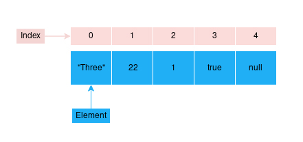

# Vetores (Arrays) em JavaScript

Em JavaScript, um **array** (ou **vetor**) é uma estrutura de dados que permite armazenar múltiplos valores em uma única variável, acessíveis por índices numéricos que começam do zero. Esses valores podem ser de diferentes tipos, como números, strings, objetos e outros arrays. Arrays são úteis para organizar e manipular coleções de dados relacionadas. 




## Sintaxe de Arrays

### Forma literal:

```js
let frutas = ["Maçã", "Banana", "Laranja"];
```

### Usando o construtor `new Array()`:

```js
let frutas = new Array("Maçã", "Banana", "Laranja");
```

### Criando array vazio com tamanho definido:

```js
let lista = new Array(3); // cria [ <3 empty items> ]
```

## Tipos de Arrays

### Array Unidimensional:

```js
let nomes = ["Maria", "João", "Ana"];
console.log(nomes[0]); // "Maria"
```

### Array Bidimensional (Matriz):

```js
let alunos = [
  ["João", "Souza", 20, "Direito"],
  ["Maria", "Gonçalves", 21, "Medicina"]
];
console.log(alunos[1][0]); // "Maria"
```

## Principais Métodos e Propriedades

| Método / Propriedade | Descrição                                              | Exemplo                          |
|----------------------|--------------------------------------------------------|----------------------------------|
| `length`             | Retorna o número de elementos do array                 | `arr.length`                     |
| `sort()`             | Ordena os elementos em ordem alfabética                | `arr.sort()`                     |
| `reverse()`          | Inverte a ordem dos elementos                          | `arr.reverse()`                  |
| `toString()`         | Converte o array em uma string separada por vírgulas   | `arr.toString()`                 |
| `join()`             | Junta os elementos usando um separador personalizado   | `arr.join('-')`                  |
| `concat()`           | Junta dois arrays ou mais                              | `arr1.concat(arr2)`              |
| `push()`             | Adiciona elementos ao final do array                   | `arr.push("item")`               |
| `pop()`              | Remove o último elemento                               | `arr.pop()`                      |
| `shift()`            | Remove o primeiro elemento                             | `arr.shift()`                    |
| `unshift()`          | Adiciona elementos no início                           | `arr.unshift("item")`            |
| `splice()`           | Adiciona, remove ou substitui elementos                | `arr.splice(2, 1)`               |
| `slice()`            | Retorna parte do array (sem modificar o original)      | `arr.slice(0, 3)`                |
| `split()`            | Divide uma string em substrings (gera array)           | `'texto'.split('')`              |
| `indexOf()`          | Retorna o índice da primeira ocorrência de um item     | `arr.indexOf("item")`            |
| `lastIndexOf()`      | Retorna o último índice de ocorrência de um item       | `arr.lastIndexOf("item")`        |
| `filter()`           | Retorna um novo array com itens que passaram em teste  | `arr.filter(condição)`           |
| `map()`              | Cria um novo array com base no original                | `arr.map(valor => valor * 2)`    |
| `reduce()`           | Reduz o array a um único valor                         | `arr.reduce(...)`                |
| `forEach()`          | Executa uma função para cada item                      | `arr.forEach(item => ...)`       |
| `every()`            | Verifica se todos os elementos satisfazem uma condição | `arr.every(condição)`            |
| `some()`             | Verifica se ao menos um elemento satisfaz a condição   | `arr.some(condição)`             |
| `includes()`         | Verifica se um item existe no array                    | `arr.includes("item")`           |


### Exemplo:

```js
let numeros = [1, 2, 3, 4, 5];

console.log(numeros.length);          // 5
console.log(numeros.join(" - "));     // "1 - 2 - 3 - 4 - 5"
console.log(numeros.includes(3));     // true

let pares = numeros.filter(n => n % 2 === 0);   // [2, 4]
let dobro = numeros.map(n => n * 2);            // [2, 4, 6, 8, 10]
let soma = numeros.reduce((a, b) => a + b);     // 15

numeros.push(6);     // [1, 2, 3, 4, 5, 6]
numeros.pop();       // [1, 2, 3, 4, 5]
```
