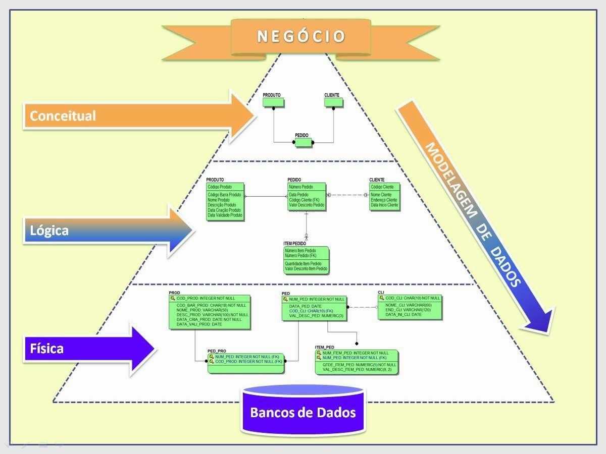
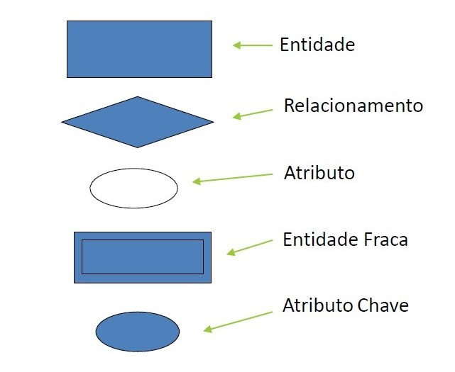
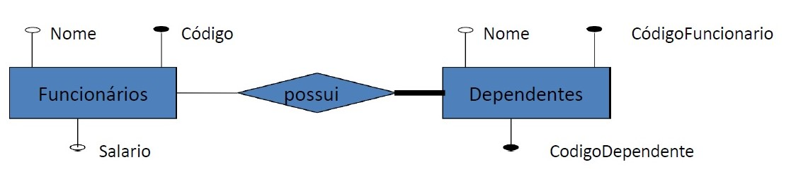
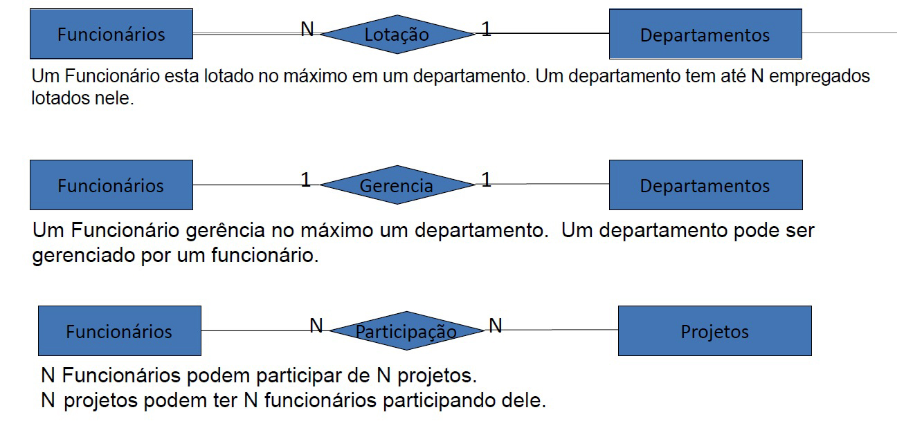

# Modelo Entidade-Relacionamento (ER)

## O que é um Modelo de Dados?
Um modelo de dados descreve como os dados são organizados, armazenados e relacionados em um banco de dados. Ele pode ser dividido em três níveis:

### Modelo Conceitual

Representa a estrutura do banco de dados de forma independente do SGBD (Sistema Gerenciador de Banco de Dados).

- Focado em capturar os requisitos do negócio.

- Utiliza o Modelo Entidade-Relacionamento (ER) para representar entidades, atributos e relacionamentos de forma visual e compreensível.

- Exemplo: Diagrama ER com entidades como "Aluno" e "Curso".

### Modelo Lógico

Traduz o modelo conceitual para uma estrutura compatível com o SGBD (geralmente relacional).

- Inclui tabelas, colunas, chaves primárias e estrangeiras.

- Exemplo: Tabela "Alunos" com colunas "ID_Aluno", "Nome", "Curso_ID".

### Modelo Físico

Detalha a implementação no SGBD, considerando otimização e armazenamento físico.

- Foca em índices, partições e desempenho.

- Exemplo: Definição de índices para a coluna "ID_Aluno" em um banco MySQL.

--- 

## Mini-mundo

O mini-mundo é uma representação simplificada do mundo real que o banco de dados modela. Inclui:

- **Usuários:** Quem interage com o sistema (ex.: administradores, clientes).

- **Aplicações:** Softwares que utilizam o banco (ex.: sistema de matrícula).

- **Banco de Dados:** Estrutura que armazena os dados do mini-mundo.

**Exemplo:** Em um sistema escolar, o mini-mundo inclui alunos, professores, disciplinas e suas interações.

---

## Componentes do Modelo Entidade-Relacionamento (ER)

### Entidades

- Representam objetos do mundo real, físicos (ex.: Pessoa, Carro) ou conceituais (ex.: Pedido, Curso).

- Representadas por retângulos nos diagramas ER.

- Exemplo: Entidade "Funcionário" com instâncias F1 (João), F2 (Maria).

### Entidade Fraca

- Depende de uma entidade forte para existir.

- Sua chave primária inclui a chave da entidade forte.

- Representada por retângulo duplo.

- Exemplo: Entidade "Dependente" (filho de um funcionário) depende da entidade "Funcionário".

### Atributos

- São as características das entidades ou dos relacionamentos.

- Representados por elipses.

- Tipos:

    - **Simples**: Indivisível (ex.: Nome, Idade).

    - **Compostos**: Divisível em partes (ex.: Endereço → Rua, Número, Bairro).

    - **Derivados**: Calculado a partir de outros atributos (ex.: Idade a partir de Data de Nascimento).

    - **Multivalorados**: Pode ter múltiplos valores (ex.: Telefones de uma pessoa).

    - **Chave**: Identifica unicamente uma entidade (ex.: CPF para "Pessoa").

### Domínio

- Define os valores válidos para um atributo.

- Exemplo:

    - Atributo "Sexo": Domínio {M, F}.

    - Atributo "Nome": Cadeia de caracteres com até 50 caracteres.

 

 

  
---

## Relacionamentos

- Representam associações entre duas ou mais entidades.

- Representados por losangos nos diagramas ER.

- Tipos:

    - **Binário**: Entre duas entidades (ex.: Aluno cursa Disciplina).

    - **Ternário**: Entre três entidades (ex.: Aluno, Professor e Projeto).

    - **Auto-relacionamento**: Entidade se relaciona consigo mesma (ex.: Funcionário supervisiona outro Funcionário).

--- 

## Cardinalidade

- Define o número de instâncias de uma entidade que podem se relacionar com outra.

- Tipos:

    - **1:1** – Um para um (ex: Estado tem uma Capital).

    - **1:N** – Um para muitos (ex: Estado possui vários Municípios).

    - **N:N** – Muitos para muitos (ex: Alunos cursam várias Disciplinas e Disciplinas têm vários Alunos).

###  Cardinalidade Mínima e Máxima

- Participação Total (obrigatória): a entidade sempre participa do relacionamento (mínima > 0).

- Participação Parcial (opcional): a entidade pode ou não participar (mínima = 0).

**Exemplo**:

- Um funcionário pode pertencer a no máximo um departamento (máxima = 1).

- Um departamento pode ter vários funcionários (máxima = N).

- A participação do funcionário é parcial (mínima = 0), mas do departamento é total (mínima = 1).

--- 

## Auto-relacionamento

- Ocorre quando uma entidade se relaciona consigo mesma.

- É necessário identificar os papéis das instâncias no relacionamento:

    - Ex: Funcionário (supervisor) supervisiona outro Funcionário (supervisionado).

--- 

## Generalização / Especialização

- **Generalização**: Criação de uma entidade genérica que reúne atributos comuns de entidades mais específicas.

     - Exemplo: Entidade "Cliente" engloba atributos de "Pessoa Física" e "Pessoa Jurídica".

- **Especialização**: Criação de entidades específicas que herdam atributos da entidade genérica.

    - Exemplo: "Pessoa Física" (com CPF) e "Pessoa Jurídica" (com CNPJ) herdam de "Cliente".

--- 

## Restrições de Integridade (RI)

- Algumas regras de negócio não podem ser representadas diretamente no modelo ER.

- Exigem regras adicionais implementadas no sistema ou documentadas separadamente.

**Exemplos:**

- Um funcionário não pode supervisionar a si mesmo.

- Alunos de graduação não podem cursar disciplinas de pós-graduação.

--- 

## Exemplo de Aplicação Escolar

Entidades:

- **Aluno**, **Professor**, **Disciplina**

Relacionamentos:

- Alunos **frequentam** disciplinas

- Professores **orientam** alunos

- Disciplinas **são ministradas por** professores

--- 

## Conclusão

O Modelo Entidade-Relacionamento é:

- Um padrão poderoso para modelagem conceitual de bancos de dados.
- Visual e intuitivo, representando entidades, atributos e relacionamentos de forma clara.
- Independente do SGBD, servindo como base para o modelo lógico e físico.
- Essencial para alinhar requisitos do negócio com a implementação técnica.
