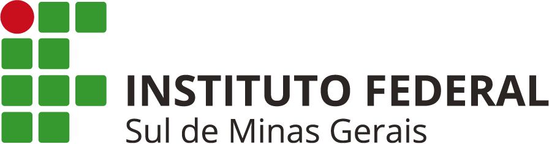

# Técnico em Informática para Internet (IFSULDEMINAS - Campus Três Corações) 

  

  ### Instituto Federal de Educação, Ciência e Tecnologia do Sul de Minas Gerais 

O curso tem como objetivo formar profissionais qualificados para atuar no desenvolvimento de aplicações web e mobile. Entre as competências desenvolvidas, destacam-se a criação e manutenção de sites e portais, além da implementação de bancos de dados.

O egresso poderá atuar em diferentes áreas da Informática, contribuindo com empresas de todos os portes e segmentos.

A formação também valoriza o trabalho em equipe, o respeito à diversidade e a capacidade de adaptação.

## Matriz Curricular

| **Componente Curricular**        | **Carga Horária** |
|----------------------------------|-------------------|
| Ambientação                      | 40                |
| Lógica de Programação            | 80                |
| Fundamentos de Informática       | 80                |
| Programação para Web I           | 80                |
| Linguagem de Programação         | 80                |
| Banco de Dados                   | 80                |
| Programação para Web II          | 80                |
| Programação Mobile I             | 80                |
| Programação Web III              | 80                |
| Programação Mobile II            | 80                |
| Redes para Web                   | 80                |
| Frameworks e Design Patterns     | 80                |
| Tópicos Especiais                | 80                |
| Libras - Optativa                | 30                |
| **Carga Horária Total do Curso** | **1.030**         |
|                                                      |

## Objetivos
- Planejar e documentar aplicações para Web e dispositivos móveis.
- Desenvolver e organizar elementos estruturais e visuais de aplicações para Web e dispositivos móveis.
- Monitorar projetos de aplicações para Web e dispositivos móveis.
- Estruturar e implementar banco de dados para aplicações Web.
- Codificar aplicações para Web e dispositivos móveis.
- Publicar aplicações para Web e dispositivos móveis.
- Documentar e realizar manutenção de aplicações para Web e dispositivos móveis.

## Curso Técnico em Informática para Internet EAD
- Duração: 15 meses
- Nível/ Modalidade: Subsequente EAD
- Eixo tecnológico: Informação e Comunicação
